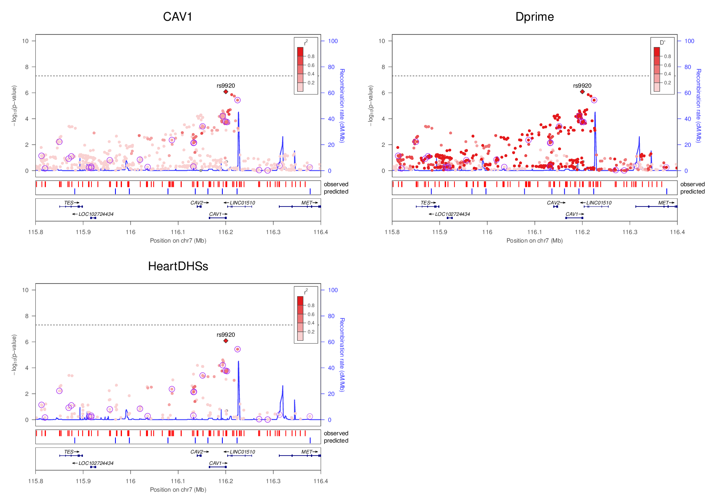
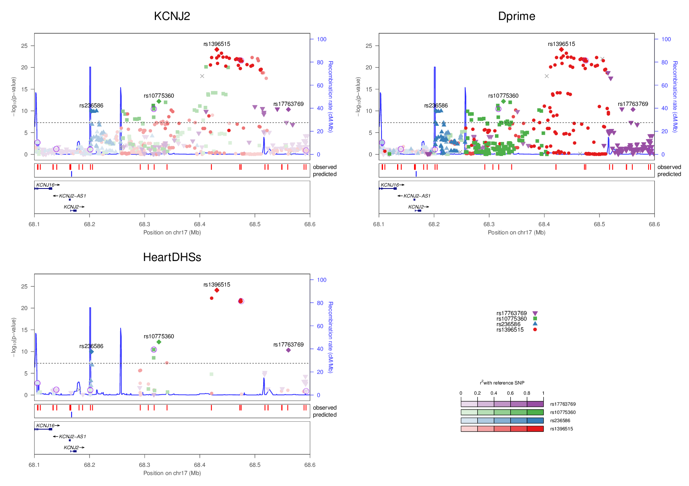

## LocusZoom plots for QT-interval associated loci
  Regional association plots for each of the 34 genome-wide significant loci for the QT interval
  GWAS meta-analysis, except for the KCNE1 locus that contains a rare missense mutation. For each locus,
  only the HapMap3 imputed SNPs used for GWAS meta-analysis (top) and those that also overlap heart
  DHSs (bottom) are shown. Purple circles denote the predicted cardiac regulatory variants that overlap
  DHSs as well as have significant deltaSVM scores from the specific model. All independent index SNPs
  are labeled and marked as diamonds, and neighboring SNPs are color-coded with different shapes based
  on their highest LD with these index SNPs. For LD, we calculated both r2 (top left) and D’ (top right) for
  comparison. Dashed lines indicate genome-wide significant P-values.

### RNF207

### TCEA3

### NOS1AP

### ATP1B1

### SLC8A1

### SP3

### CCDC141

### SPATS2L

### SCN5A

### C3ORF75

### SLC4A4

### SMARCAD1

### GFRA3

### GMPR

### PLN

### CAV1

### KCNH2

### NCOA2

### LAPTM4B

### AZIN1

### GBF1

### KCNQ1

### FADS2

### ATP2A2

### KLF12

### ANKRD9

### TRPM7

### CREBBP

### LITAF

### MKL2

### CNOT1

### LIG3

### PRKCA

### KCNJ2

*last updated: 12/14/2017*
